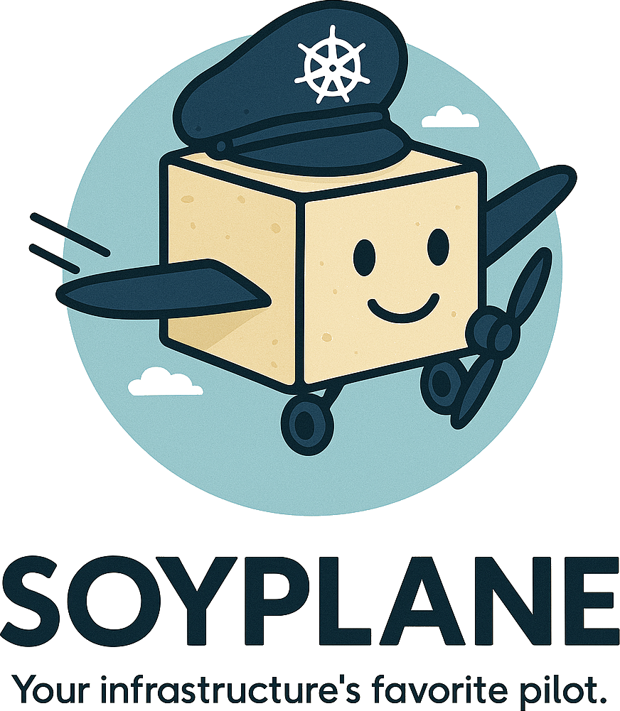

<p align="center">
  <br/>
</p>

🚀 A friendly, OpenTofu-compatible Terraform operator for Kubernetes with native GitOps and Argo CD integration.

**Plan, apply, and detect drift — declaratively.**

NB: This project is still in early stage of development and will change considerably, any feature requests, comments, or suggestions are very welcome
---

## ✨ Features

- 🔁 Declarative `TerraformDeployment` CRD
- 🔐 Secure variable injection from Secrets/ConfigMaps
- 📦 Native OpenTofu support
- 🔎 Drift detection with cron scheduling
- 🌀 Argo CD-friendly: Apply and Plan via annotations
- 📤 Export outputs to Secrets/ConfigMaps
- 🔧 Flexible backend and plan/apply behavior

---

## 🚀 Getting Started

Please check the [getting started](docs/INSTALL.md) guide.

---

## Project Distribution

Following the options to release and provide this solution to the users.

### By providing a bundle with all YAML files

1. Build the installer for the image built and published in the registry:

```sh
make build-installer IMG=<some-registry>/soyplane:tag
```

**NOTE:** The makefile target mentioned above generates an 'install.yaml'
file in the dist directory. This file contains all the resources built
with Kustomize, which are necessary to install this project without its
dependencies.

2. Using the installer

Users can just run 'kubectl apply -f <URL for YAML BUNDLE>' to install
the project, i.e.:

```sh
kubectl apply -f https://raw.githubusercontent.com/<org>/soyplane/<tag or branch>/dist/install.yaml
```

### By providing a Helm Chart

1. Build the chart using the optional helm plugin

```sh
kubebuilder edit --plugins=helm/v1-alpha
```

2. See that a chart was generated under 'dist/chart', and users
can obtain this solution from there.

**NOTE:** If you change the project, you need to update the Helm Chart
using the same command above to sync the latest changes. Furthermore,
if you create webhooks, you need to use the above command with
the '--force' flag and manually ensure that any custom configuration
previously added to 'dist/chart/values.yaml' or 'dist/chart/manager/manager.yaml'
is manually re-applied afterwards.

---

## 📘 Docs

Documentation will live at [soyplane.io](https://soyplane.io) — WIP!

---

## 🤝 Contributing
// TODO(user): Add detailed information on how you would 

Contributions, ideas, and PRs are welcome!  
Feel free to open issues or start a discussion.

**NOTE:** Run `make help` for more information on all potential `make` targets

More information can be found via the [Kubebuilder Documentation](https://book.kubebuilder.io/introduction.html)

---

## 📜 License

Copyright 2025 Othmane El Warrak.

Licensed under the Apache License, Version 2.0 (the "License");
you may not use this file except in compliance with the License.
You may obtain a copy of the License at

    http://www.apache.org/licenses/LICENSE-2.0

Unless required by applicable law or agreed to in writing, software
distributed under the License is distributed on an "AS IS" BASIS,
WITHOUT WARRANTIES OR CONDITIONS OF ANY KIND, either express or implied.
See the License for the specific language governing permissions and
limitations under the License.

